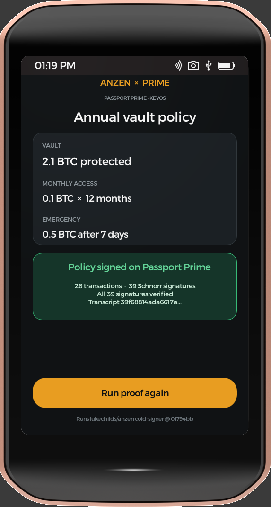

# KeyOS Anzen

## Anzen Policy Approval

A Passport Prime development app for the hardware-wallet side of
[Luke Childs' Anzen](https://github.com/lukechilds/anzen). It imports Luke's
current version-4 `PolicyPackage` JSON, presents the owner-visible policy for
review, independently validates the descriptor, all 28 PSBTs, transaction
relationships, fixed fees, and phone signatures, then adds Passport Prime's
HWW signatures and writes Luke-compatible approved JSON.

The current upstream protocol is pinned to commit
`01794bb14d34d01413e3b539c7e5496ecbce0c87`.

## Development Prime flow

The physical-target app deliberately uses a file bridge until Anzen defines a
real phone transport for this device:

1. Place `anzen-policy-v4.json` in the development USB folder.
2. Press **Import development package**. Import is bounded to 128 KiB and does
   not request KeyOS app-seed material.
3. Review the vault amount, monthly access, emergency path, network, fee rate,
   and PSBT count.
4. Press **Approve and export**. Only then does the app request its KeyOS-isolated
   seed, derive the descriptor-bound HWW identity, revalidate the entire package,
   sign, and atomically commit `anzen-policy-v4-approved.json`.

An invalid package, identity mismatch, write failure, or commit failure does not
replace an existing approved package. Seed material, private keys, PSBT bodies,
and approved JSON are never logged.

Foundation's hosted simulator does not mount a USB volume. Its explicitly
labelled simulator build therefore imports the same real Luke-generated regtest
fixture embedded at compile time and atomically stores the approved JSON in
app-private simulator storage. Because the hosted security service has no
logged-in hardware seed session, that build also uses the fixture's deterministic
test seed and labels it on screen. The device-target build continues to use the
bounded USB flow and KeyOS-isolated app seed above.

## PolicyPackage v4 interoperability

The checked-in fixture is a deterministic, disposable regtest proposal created
by Luke's code. The public **Luke CLI regtest round trip** CI job also creates a
fresh policy with Luke's unchanged CLI, passes it through this repository's
approval engine, and has Luke's unchanged CLI validate, activate, and broadcast
the rollover on disposable Bitcoin Core regtest state.

The dated
[PolicyPackage v4 evidence record](docs/evidence/policy-package-v4-roundtrip-2026-08-14.md)
documents that host round trip. The separate
[Prime target record](docs/evidence/prime-policy-v4-target-2026-08-14.md)
documents the signed device-target build without treating it as runtime proof.
The
[PolicyPackage v4 simulator record](docs/evidence/prime-policy-v4-simulator-2026-08-14.md)
documents the owner-accepted hosted flow while preserving its fixture and test-seed
boundaries.

## Current proof boundary

- Host tests prove bounded import, owner-visible summary, independent package
  validation, approval ordering, deterministic HWW signing, atomic export
  behavior, and Luke-compatible JSON.
- Public CI proves Luke's unchanged CLI accepts the approved package on regtest.
- Foundation SDK v0.4.0 builds, strips, manifests, and signs the complete app for
  `armv7a-unknown-xous-elf`.
- The hosted simulator visibly completes the labelled real-fixture review and
  approval flow using a deterministic simulator-only seed and app-private output.
- The success screen reports independent-validation, 28-signature, and total
  approve-to-write timing. Preview and simulator values are labelled as
  non-hardware; only a physical Prime run is presented as hardware timing.
- A target build is not simulator or physical-device execution evidence.

The file bridge is not Anzen phone connectivity. Production transport,
persistence hardening, mobile integration, mainnet safety, physical-device
execution, broadcasting from Prime, and real-funds use remain unimplemented or
unproved.

## Earlier benchmark proof

Before the real package engine was integrated, the app ran Luke's allocation-free
28-transaction/39-signature hardware-wallet benchmark in the Passport Prime
simulator. That historical proof remains useful as evidence that KeyOS seed
access and the signing workload execute in the hosted environment, but it is no
longer the product flow.



The historical details remain in
[the original simulator record](docs/evidence/prime-simulator-2026-08-14.md).

## Repository layout

- `crates/anzen-policy-engine` — PolicyPackage v4 parsing, validation, and signing.
- `crates/anzen-prime-core` — host-testable review, approval, and atomic export flow.
- `tools/anzen-prime-adapter` — development host adapter used for CLI interoperability.
- `fixtures/policy-package-v4` — deterministic regtest proposal and provenance.
- `vendor/anzen-cold-signer` — verbatim MIT-licensed upstream benchmark snapshot.
- `app` — native KeyOS filesystem, seed, and Slint UI shell.
- `preview` — Windows rendering of the same review/approval flow using test material.

## Verify on the host

```sh
cargo fmt --all --check
cargo test --workspace --release --locked
cargo clippy --workspace --all-targets --release --locked -- -D warnings
```

With Docker available, run the pinned Luke CLI/Bitcoin Core round trip:

```sh
./scripts/verify-luke-roundtrip.sh
```

The script uses only disposable regtest state and deletes its isolated Docker
project, named volume, and temporary files on exit.

## Run the Windows preview

```powershell
cargo run -p anzen-prime-preview --release
```

The preview uses the real checked-in PolicyPackage fixture and the same policy
engine and Slint UI. It substitutes a deterministic test app seed and in-memory
output because KeyOS filesystem and app-seed APIs exist only in the Prime
environment. It is labeled **Windows preview** on screen.

## Build for Passport Prime

Install the current [Foundation Passport Prime SDK](https://foundation.xyz/developers),
create a local signing identity named `KeyOS Anzen Developer`, then run from the
repository root:

```sh
scripts/prime-sdk.sh doctor
scripts/prime-sdk.sh build
scripts/prime-sdk.sh sim
```

The SDK is currently a public beta and Foundation's supported host path is Linux
or macOS. This repository is developed from Windows through a bounded Ubuntu VM
workflow.

When hardware sideloading becomes available, use the compact
[Prime hardware timing test card](docs/prime-hardware-timing-test.md) to collect
one cold run and four warm runs for Luke without conflating simulator timing.

## Contributing

Material changes use an issue, a focused branch, automated checks, and a pull
request. See [`CONTRIBUTING.md`](CONTRIBUTING.md) for proof-labelling rules.

## Attribution

Anzen and `anzen-cold-signer` are by Luke Childs and licensed under MIT. The
vendored snapshot retains Luke's license and provenance. This Prime integration
is an independent proof and is not an official Anzen or Foundation product.
