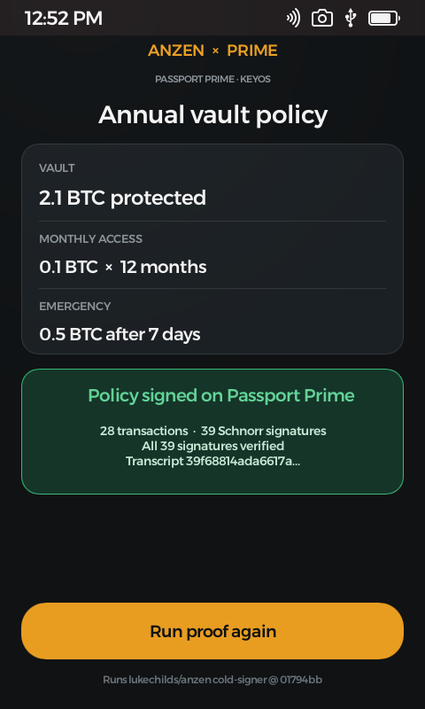

# KeyOS Anzen

## Anzen Prime Proof

A minimal Passport Prime app that runs the largest hardware-wallet benchmark
currently published by [Luke Childs' Anzen](https://github.com/lukechilds/anzen):
28 Taproot transactions and 39 BIP340 Schnorr signatures in one approval.

The point is deliberately narrow: Anzen's current Ledger and Trezor work is a
benchmark, and the same benchmark can run as a native KeyOS app on Passport
Prime.



_Passport Prime simulator capture. The app completed Luke Childs' 28-transaction
workload, produced 39 Schnorr signatures, and verified all 39._

The earlier [Windows preview](screenshots/windows-preview.png) remains available
as a separately labelled host-rendering reference.

## What the demo proves

- Uses Anzen's actual allocation-free `anzen-cold-signer` benchmark, pinned to
  upstream commit `01794bb14d34d01413e3b539c7e5496ecbce0c87`.
- Derives a demo signing identity from KeyOS's app-isolated seed.
- Reconstructs Anzen's 28-transaction annual policy workload.
- Produces 39 real BIP340 Schnorr signatures for the 12-input case.
- Verifies every signature and commits the run to a transcript hash.
- Exposes only the public key and transcript; the app seed and private key stay
  inside the app process.
- Builds as a signed KeyOS device bundle and runs as a hosted app in the
  Passport Prime simulator.

## What it does not claim

This is a compatibility proof, not a production Anzen wallet. It does not yet
parse Anzen policy packages, communicate with the Anzen phone app, persist a
vault, or move funds. Those are protocol and product-integration steps after
the hardware capability is demonstrated.

## Repository layout

- `vendor/anzen-cold-signer` — verbatim MIT-licensed upstream snapshot.
- `crates/anzen-prime-core` — host-testable Prime signing integration.
- `app` — thin native KeyOS/Slint shell.

## Test the signing core

```sh
cargo test --workspace
cargo clippy --workspace --all-targets -- -D warnings
```

## Run the Windows preview

The desktop preview uses the same signing core and the same 480×800 Slint UI,
but substitutes a deterministic test app seed because KeyOS's app-isolated
seed API exists only on Passport Prime:

```powershell
cargo run -p anzen-prime-preview --release
```

It is intentionally labeled **Windows preview** on screen. The genuine Prime
simulator evidence is the primary screenshot at the top of this page.

## Build for Passport Prime

Install the current [Foundation Passport Prime SDK](https://foundation.xyz/developers),
create a local signing identity named `KeyOS Anzen Developer`, then run from
the repository root:

```sh
scripts/prime-sdk.sh doctor
scripts/prime-sdk.sh build
scripts/prime-sdk.sh sim
```

The Prime SDK is currently a public beta and Foundation's supported host path
is Linux or macOS. This repository was developed from Windows using an Ubuntu
VM for the SDK build and simulator.

The genuine simulator milestone is recorded in
[`docs/evidence/prime-simulator-2026-08-14.md`](docs/evidence/prime-simulator-2026-08-14.md)
and tracked publicly in
[#1 Prime simulator proof](https://github.com/owenkemeys/KeyOS-anzen/issues/1).

## Contributing

Material changes use an issue, a focused branch, automated checks, and a pull
request. See [`CONTRIBUTING.md`](CONTRIBUTING.md) for the workflow and proof
labelling rules.

## Attribution

Anzen and `anzen-cold-signer` are by Luke Childs and licensed under MIT. The
vendored snapshot retains Luke's license and has an explicit provenance note.
The Prime integration is an independent proof and is not an official Anzen or
Foundation product.
